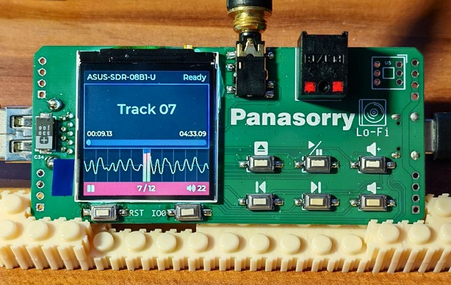
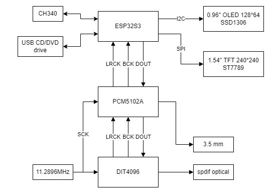

# ESP32_CD_Player
Play music from cdda disc in USB drive



原理图:  
[Schematic pdf](doc/SCH_Schematic1_2024-07-25.pdf)

PCB:  
[https://oshwhub.com/linscon/esp32_cd_player](https://oshwhub.com/linscon/esp32_cd_player)

# 电路结构 Circuit structure



### 注意 NOTE

DIT4096用于I2S与SPDIF转换，如果你不需要spdif输出，可以移除此芯片。  
但在我的电路中，I2S的时钟（LRCK BCK）都是由DIT4096生成的，esp32工作在从模式。  
所以如果不要这芯片，且没有别的外部时钟源，需要修改代码由esp32生成这些时钟

DIT4096 is used for I2S to SPDIF conversion. If you don't need spdif output, you can remove this chip.

In my circuit, the clock of I2S (LRCK BCK) are generated by DIT4096, so ESP32's I2S config as slave mode.  
If your circuit have no other external I2S clock source, you need to modify the code to make ESP32  
work in master mode to generate these clock.

In [components/myDriver/i2s.c](components/myDriver/i2s.c) Line 137

```C
i2s_chan_config_t chan_cfg = I2S_CHANNEL_DEFAULT_CONFIG(I2S_NUM_AUTO, I2S_ROLE_SLAVE);
// change to
i2s_chan_config_t chan_cfg = I2S_CHANNEL_DEFAULT_CONFIG(I2S_NUM_AUTO, I2S_ROLE_MASTER);
```